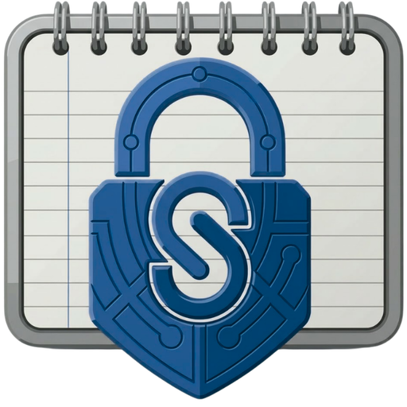
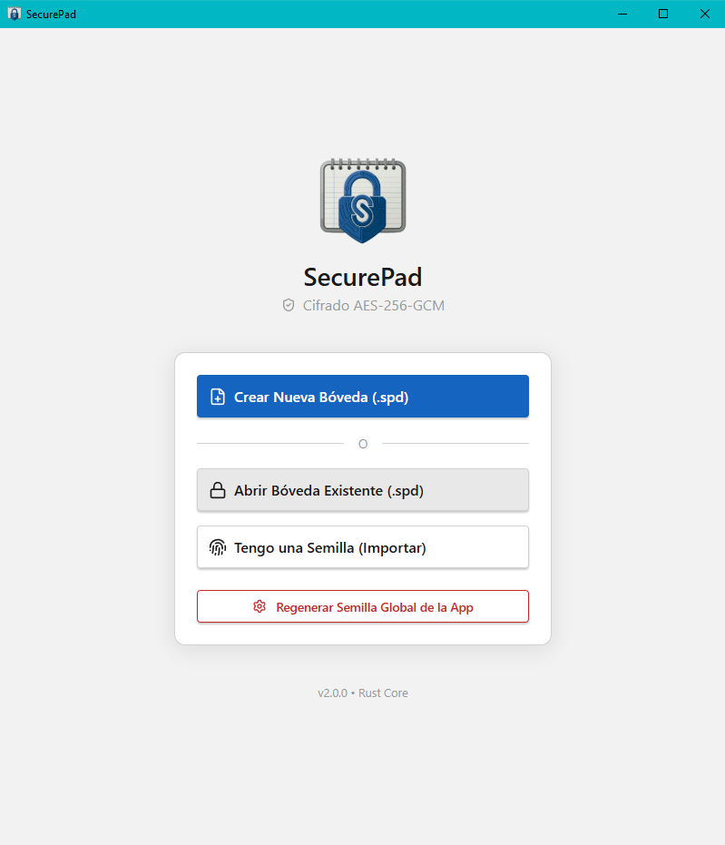
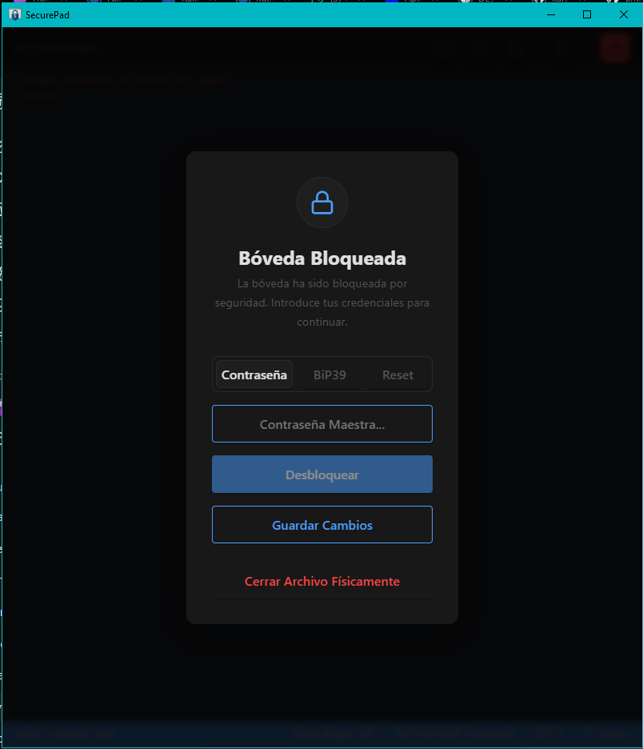
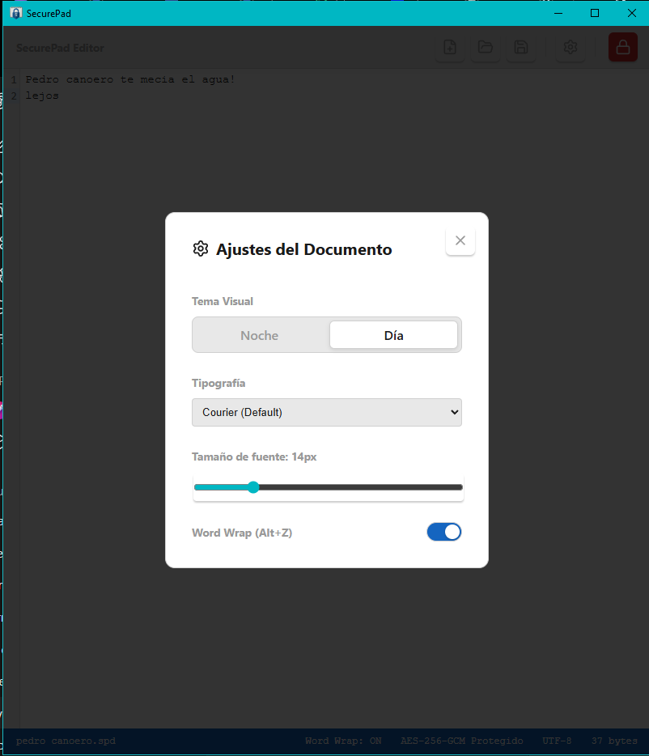

<div align="center">
  
  <h1>SecurePad v2</h1>
  <p>
    <strong>Minimal encrypted notes.</strong><br>
    Protege tus textos y códigos con cifrado AES-256-GCM.<br>
    Sin nube. Sin cuentas. Solo tus llaves.
  </p>
</div>

---

## 📥 Descargar

Puedes descargar la última versión desde:

➡️ **[Releases](../../releases/latest)**

Archivos disponibles:

**Windows**

* SecurePad_windows_x64.msi
* SecurePad_windows_portable.exe

**Android**

* SecurePad_android.apk

---

## 🛡️ ¿Qué es SecurePad?

SecurePad es un editor de texto seguro y ultraligero que cifra todo su contenido en archivos locales `.spd` utilizando **AES-256-GCM**.

No depende de servidores, cuentas ni servicios en la nube.

Diseñado originalmente en **Flet (Python)**, la **Versión 2 fue completamente reescrita** usando:

* **Rust** para el motor criptográfico
* **Tauri v2** para empaquetado nativo
* **React + TypeScript** para la interfaz

Esto reduce significativamente el consumo de memoria y mejora la velocidad del editor.

---

## ✨ Características

| Feature               | Descripción                             |
| --------------------- | --------------------------------------- |
| 🔐 AES-256-GCM        | Cifrado autenticado seguro              |
| 🦀 Motor en Rust      | Criptografía nativa usando RustCrypto   |
| 📝 Editor CodeMirror  | Editor rápido con resaltado y Word Wrap |
| 🔑 Recuperación BIP39 | Recupera tu bóveda con 12 palabras      |
| 🔒 Auto-Lock          | Bloqueo automático tras inactividad     |
| 🔁 Compatibilidad     | Lee bóvedas creadas con la versión Flet |

---

## 🖼️ Screenshots

### Pantalla de Inicio

<p align="center">
  
</p>

### Pantalla de Bloqueo

<p align="center">
  
</p>

### Configuración

<p align="center">
  
</p>

---

## 🛠️ Stack Tecnológico

**Core / Backend**

* Rust 🦀
* RustCrypto

**Frontend**

* TypeScript
* React
* CodeMirror

**App Framework**

* Tauri v2

---

## 🧑‍💻 Desarrollo

Requisitos:

* Node.js v18 o superior
* Rust (stable vía `rustup`)
* Visual Studio Build Tools con C++ (Windows)
* Android Studio + SDK / NDK

---

### Ejecutar en modo desarrollo

```
npm install
npm run tauri dev
```

⚠️ No abras el proyecto en `localhost` dentro de tu navegador.

Tauri expone APIs del sistema **solo dentro de la ventana nativa**.

---

## 📦 Compilar

### Windows

```
npm run tauri build
```

Output:

```
src-tauri/target/release/bundle/
```

---

### Android

Inicializar entorno Android:

```
npm run tauri android init
```

Compilar APK:

```
npm run tauri android build
```

Output:

```
src-tauri/gen/android/app/build/outputs/apk/universal/release/
```

---

## 📜 Licencia

Este software se distribuye **tal cual** bajo licencia libre.

Consulta el archivo `LICENSE` para más detalles.

---

> **Tus pensamientos. Tus llaves. Tu bóveda.**
